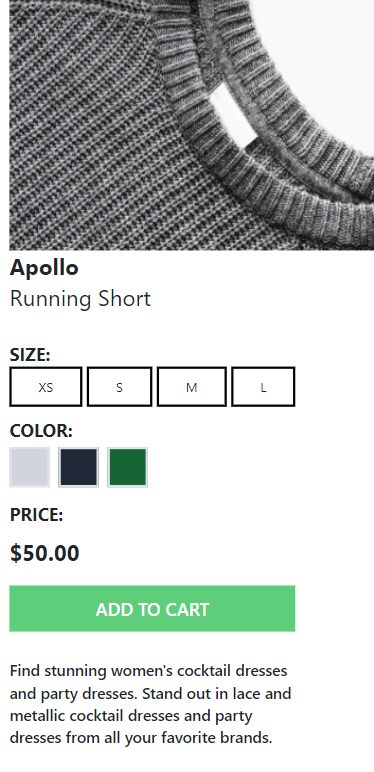
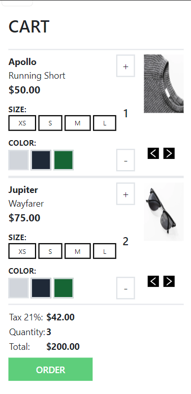

[](site-logo.png)

# TUTADOO Frontend React Assessment

## By: ROY OKITE

## Project Description

This is the frontend react application for a clothing ecommerce website. Green Commerce is the name of the website, which has been designed to display a page of all the products available with details including the image, name and price as well as colour and size options with a cart functionality to complete it.

The application meets the following requirements:

- It is a single page application.
- It is Intuitive and has an easy to follow layout.
- It is mobile responsive to fit smaller device screens.
- It utilises pages and components for code organization and resusability.
- The application employs the use of client-side routing for page to page navigation.
  <br />
  <br />

## Deliverables

The app utilizes React, Tailwind CSS for styling and Javascript/JSX for interactivity.

A user is able to:

- View product information on available products.
  <br /> <br />
  
  <br /> <br />
- View each item with more details such as the size and colour options.
  <br /> <br />
  
  <br /> <br />
- View all items currently in the cart.
  <br /> <br />
  
  <br /> <br />
- Menu cart overlay.
  <br /> <br />
  
  <br /> <br />
- Menu currency dropdown.
  <br /> <br />
  
  <br /> <br />
- Mobile samples.
  <br /> <br />
  
  
  
  
  <br /> <br />

## Setup Instructions

The project has been developed locally and run using npm. Additional packages have been used to improve
the look and feel of the site and give it a clean and polished look.

You may clone and run the code locally to interact with the current iteraction of the assessment.

### Closing

This react app took a few days to develop to closely match the given figma design. More interactivity and modifications will be made overtime even after submission to polish the style, data and components available on the app where necessary.

Sample code to design each product card:

```
 const ProductCard = ({item}) => {
  const navigate = useNavigate();
  const handleClick = () => navigate(`/products/${item.id}`);
  const { inCart } = useCart();

  return (
    <article onClick={handleClick} className={`p-3 hover:cursor-pointer ${inCart(item.id) ? "product-card" : ""}`} style={{ pointerEvents: `${(item.id === 3) ? 'none' : ''}`}}>
      <div className="relative">
        
        { inCart(item.id) && }
      </div>
      <p className={`${(item.id === 3) ? "text-slate-300" : ""}`}>{item.title} {item.tag}</p>
      <p className={`font-semibold ${(item.id === 3) ? "text-slate-300" : ""}`}>${item.price}</p>
    </article>
  );
}
```

### Closing

All the information and resources used have been sourced from publicly available resources as well as the aforementioned figma design file. This is a project aimed to train development as well as complete
a front end react assesment by Tutadoo.

## This project aims to fulfill requirements for a Frontend React Assessment.